# Networking-API

## Description

This project was built using MongoDB, Mongoose NPM package, Node.js, and Express.js for the server. The purpose of this poroject was to create an API for a social network that can save user accounts and full CRUD operation for the user. Each user document has an associated thoughts("posts") document tied to the user. Furthermore, each thought document has an associated reactions("comments") records associated to it as well in Mongo. This API provides full CRUD operation with their respective endpoints and documents. Completing this project has furthered my understanding of Mongo/Mongoose ODM.

## Table of Contents

- [Installation](#installation)
- [Usage](#usage)
- [Credits](#credits)
- [License](#license)
- [Contributions](#how-to-contribute)
- [Tests](#tests)
- [Questions](#questions)

## Installation

- Navigate to the [Github](https://www.github.com/alexanderolivares13):  
- Clone the github repository to the directory you would like to use.
- On the root file of the project run `npm install` to install any necessary dependencies.
- Run `npm run server` to start the server.
- Test the endpoints given in the [Usage](#usage) section using Insomnia.

## Usage

Watch the video walkthrough: https://drive.google.com/file/d/1tDsrbpxopjwJzK7mEWWVO_sabFAU4ZZK/view 

First we have the users endpoint of the api. All examples provided will be used using the localhost connection running with Express. 
`http://localhost:3001/api/users/` 
This endpoint supports `GET` and `POST` requests. 

### Users

---

- The `GET` request will return all users in the database:

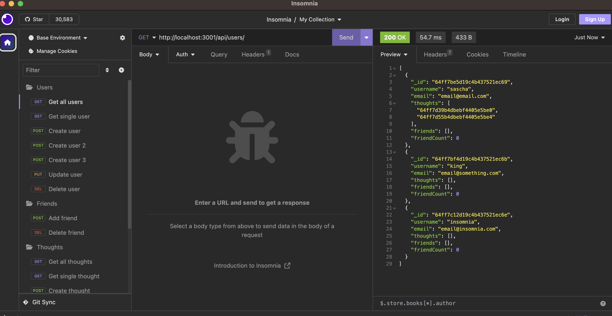

- The `POST` structured as `{username: "yourUsername", email: "yourPassword"}` will create a new user:

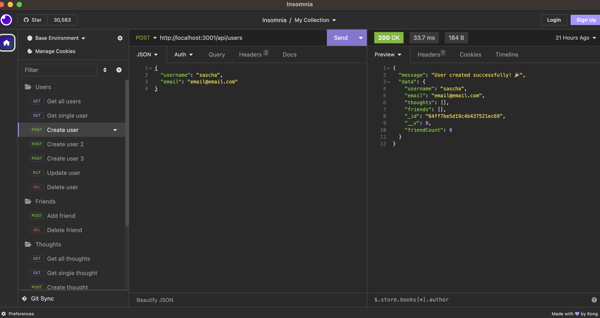

The next endpoint supports the `PUT` and `DELETE` requests. As well as a 2nd `GET` request to only return a specific user 
`http://localhost:3001/api/users/:userId` 
The `:userId` query parameter is the object's `_id:` property. 

- The `PUT` request structured as `{username: "yourUsername", email: "yourPassword"}` will update both fields for the user with the specified `_id`:

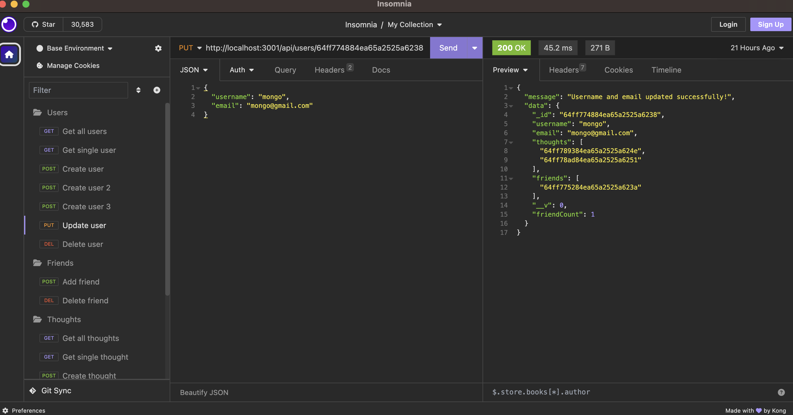

- The `DELETE` request doesn't require a request body, instead it just takes in the `:userId` parameter and deletes the document in Mongo and any thoughts associated to that user:

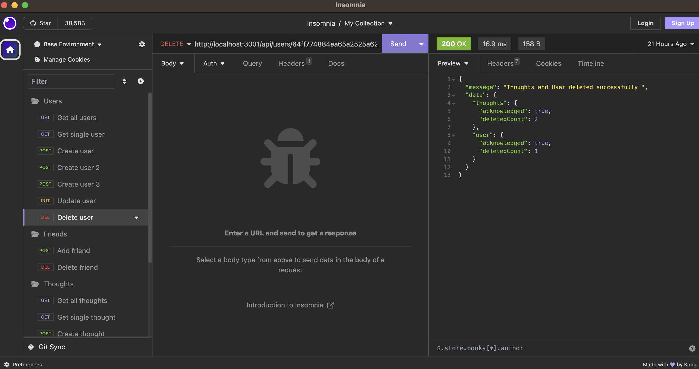

### Thoughts

---

The next endpoint will cover the `GET` and `POST` routes for the thought documents. 
`http://localhost:3001/api/thoughts`

- The `GET` request will return all thoughts with any respective Reaction object ids:

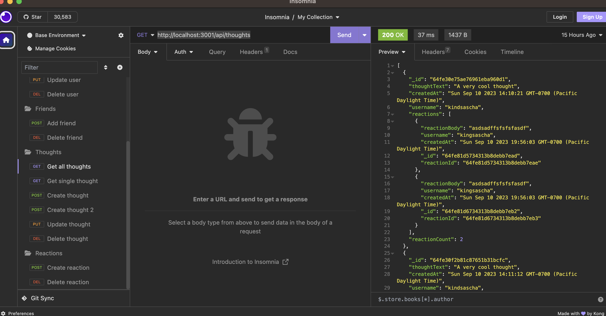

- The `POST` request structured as `{username: "yourUsername", thoughtText: "some text"}` will create a new thought based on the username. Reflecting the user making the request:

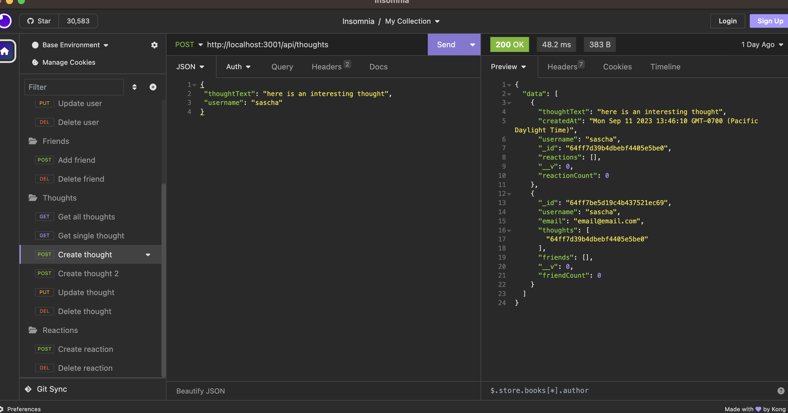

The next endpoint will cover the `PUT` and `DELETE` requests, as well as a 2nd `GET` request that returns only a single record. 
`http://localhost:3001/api/thoughts/:thoughtId` 
The `:thoughtId` query parameter is the object's `_id:` property. 

- The `PUT` request structured as `{username: "yourUsername", thoughtText: "some text"}` will update both fields for the user with the specified `_id`:

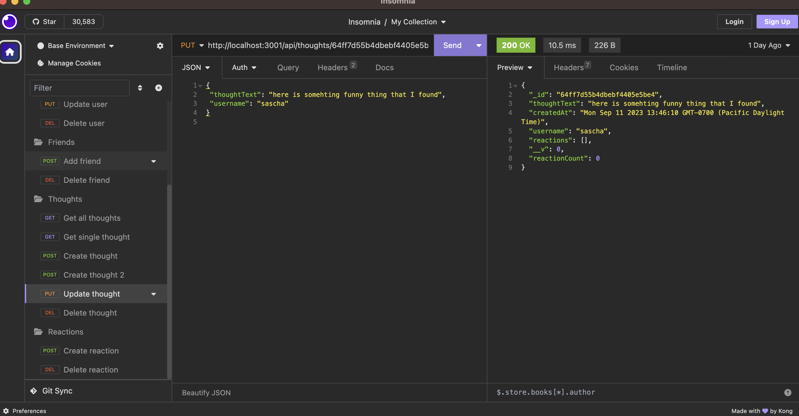

- The `DELETE` request doesn't require a request body, instead it just takes in the `:thoughtId` parameter and deletes the document in Mongo and any reactions associated to that thought:

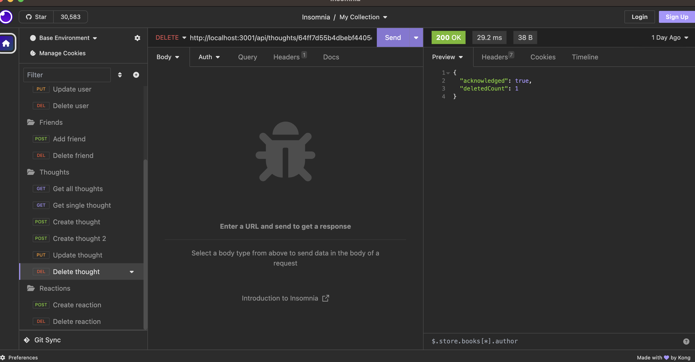

### Reactions

---

This following endpoint is used to create a reaction within a defined thought document.  
`http://localhost:3001/api/thoughts/:thoughtId/reactions` 
This endpoint also utilizes the `:thoughtId` query parameter to define which thought that the reaction will post to. The endpoint only supports `POST` requests.

- The `POST` request structured as `{reactionBody: "reaction text",username: "yourUsername}`:

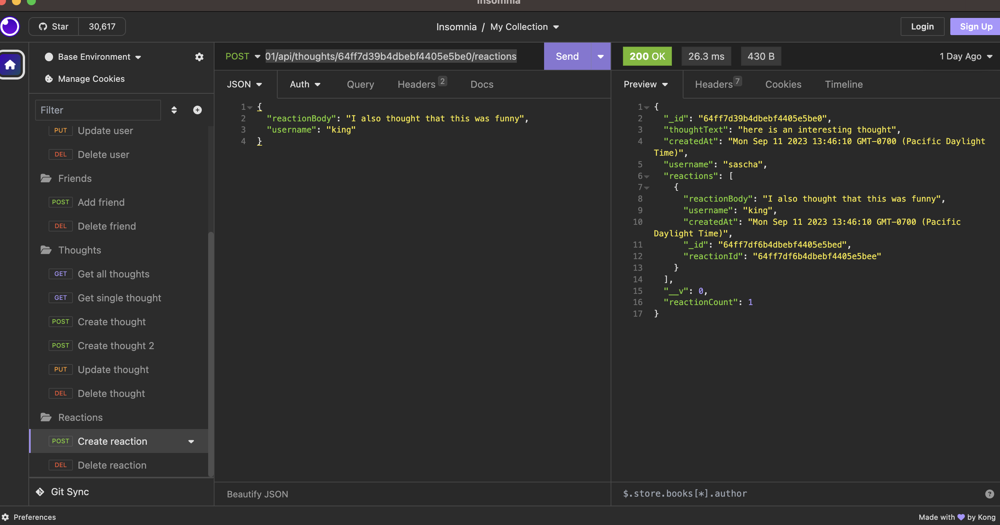

The next endpoint is used to delete a reaction within a specific thought document. 
`http://localhost:3001/api/thoughts/:thoughtId/reactions/:reactionId` 
The endpoint utilizes both the `:thoughtId` query parameter, which is the objects `_id:` property. As well as, the `:reactionId` which in this case uses the `reactionId:` property of the reaction document.

- The `DELETE` request doesn't require a request body, only the correct parameters passed in to the API route.

### Friends

---

The last endpoints we have is used to add and remove friends from the User documents. 
`http://localhost:3001/api/users/:userId/friends/:friendId` 
This endpoint uses the `:userId` and the `:friendId` query parameters, where the userId is the objectId `_id:` of the user sending the request, and the friendId is the objectId of the friend to be added

- This `POST` request does not require a request body, and can just be sent using both parameters.

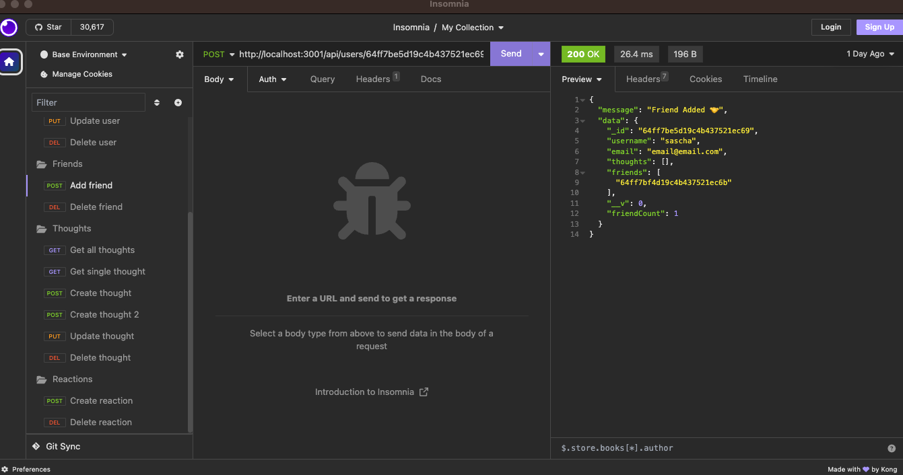

- This `DELETE` request uses the same endpoing, but instead the `:friendId` will represent the friend to be deleted, and the `:userId` is the user sending the delete request:

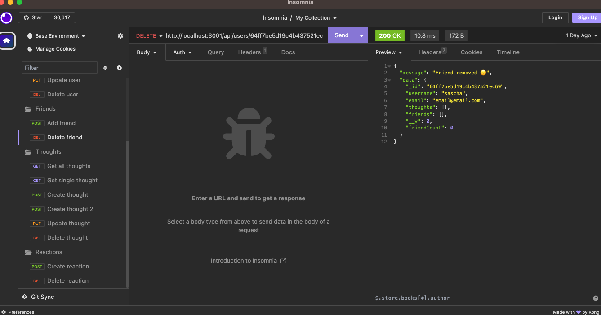

## Credits

- Express.js NPM package: https://www.npmjs.com/package/express
- Mongoose ODM package: https://www.npmjs.com/package/mongoose
- Luxon NPM package for date creation: https://www.npmjs.com/package/luxon

## License

This project is licensed under the MIT License

## How to Contribute

N/A

## Tests

N/A

## Questions

My work can be found on Github at [alexanderolivares13](https://www.github.com/alexanderolivares13)

If you have any further questions you can contact me at my email at: [alexander.olivares1310@gmail.com](mailto:alexander.olivares1310@gmail.com)
